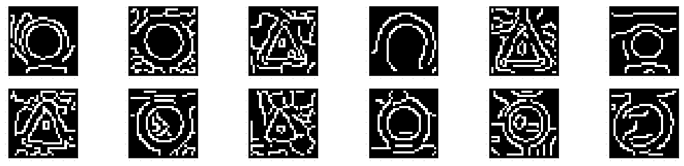
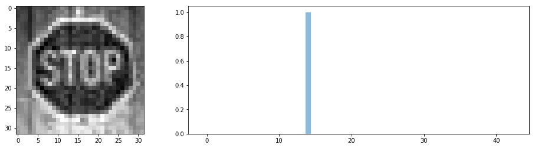
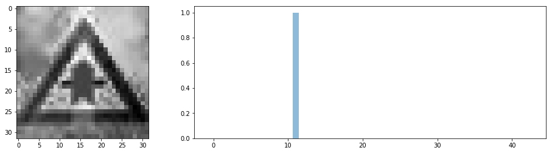

**Traffic Sign Recognition**
============================

Code
----

The associated code is located at: [Traffic Sign Classifier Jupyter
Notebook.](Traffic_Sign_Classifier.ipynb)

Data Set Summary & Exploration
------------------------------

Using the NumPy library, we conclude that the images are from the padded [German
Traffic Sign Dataset](http://benchmark.ini.rub.de/?section=gtsrb&subsection=new)
are 32×32 pixels over three color channels. We count 34799 training examples,
4410 validation examples and 12630 testing examples. The signs are classified
into 43 classes.

| Image data shape              | (32, 32, 3) |
|-------------------------------|-------------|
| Number of training examples   | 34799       |
| Number of validation examples | 4410        |
| Number of testing examples    | 12630       |
| Number of classes             | 43          |

### Distribution

The classifier should be better than humans across all classes. If it is not, it
may be because of the uneven dataset across classes. The classifier is a mere
reflection of the dataset. A way to correct this defect may be to generate
examples for each classes by altering them with noise, rotations, translations,
... as described in [Sermanet Ijcnn
11](http://yann.lecun.com/exdb/publis/pdf/sermanet-ijcnn-11.pdf)so that the
resulting distribution is less uneven than the original one and with enough
examples per class for the classifier to learn better.

Here are the distribution of the examples across the classes for the training,
validation and test data sets:

### Visualisation

In all images, the vast majority of pixels are attributed to the signs. It is
probably useful to preprocess images to make their contrasts roughly equal so
that the network can focus on what matters: the signs, and not the signs in all
the different possible contrasts.

Preprocessing
-------------

We use the [scikit-image](http://scikit-image.or) to preprocess images. The
preprocessing step consists of 3 transformations: correcting the contrast,
grayscaling then removing the mean from the images. We did not include the edge
detection data since we judged the data too noisy. The transformations are
described below.

### Contrast

It’s possible to equalise the contrast across the images using a function for
the [scikit-image](http://scikit-image.or) library. It let the model focus on
the differences that matters, i.e. the signs, more than the contrast variations
from one image to an other.

Here is a before and after comparison:

### Grayscale

Since the differences between the signs seem to rely essentially on shapes and
forms, it's worth trying to grayscale the images because it divides the number
of pixels by 3 (1 gray channel instead of 3 RGB channels) and keeps what
matters: shapes and forms.

Here is a before and after comparison:

### Edge detection

All signs are bounded by a geometrical form: circle, triangle, square... The
edge of the bounding form makes a sharp contrast with the background. I thought
it might be a good idea to augment the grayscale images with detected edges
using the Canny algorithm:

Here is a before and after comparison:

Unfortunatly and after many trial and errors, I did not find a good enough set
of parameters. Images are too small maybe? First order derivative eats at least
2x the pixels compared to images themselves.

### Scaling

Finally, we scale the images so that pixels values have zero mean. It makes the
optimisation easier and does not subtract information from the images because it
is not encoded in their pixels absolute values but the relative differences
between pixels, which is preserved by translation:

~~~~~~~~~~~~~~~~~~~~~~~~~~~~~~~~~~~~~~~~~~~~~~~~~~~~~~~~~~~~~~~~~~~~~~~~~~~~~~~~
A preprocessed image mean = -1.04083408559e-17 ≈ 0
~~~~~~~~~~~~~~~~~~~~~~~~~~~~~~~~~~~~~~~~~~~~~~~~~~~~~~~~~~~~~~~~~~~~~~~~~~~~~~~~

Model
-----

The model is essentially LeNet-5 ([LeCun
98](http://yann.lecun.com/exdb/publis/pdf/lecun-01a.pdf)) because it showed to
be working on similar objects: digits classification. Instead of digits, we have
signs for which I cannot find any good reason why it would not work, *a priori*.
We tried various configurations, including changing activation functions,
concatenating layer 1 and layer 2 outputs as described in [Sermanet Ijcnn
11](http://yann.lecun.com/exdb/publis/pdf/sermanet-ijcnn-11.pdf), various
learning rates, introducing new layers, etc. Eventually, time ran out and we
settled with just LeNet-5 and deeper layers. A dropout has been added in between
the last two fully connected layers in an attempt to increase the model accuracy
on test data, but it did not change much.

We obtained an accuracy of 94% on the validating set and 4% on the testing set.
This terrible overfitting was obtained by first getting the preprocessing
“right”: keeping the colours made training relatively slower and less accurate.
It gave us the kind of vectors the model should process, i.e. 32x32x1 not
32x32x3. It also fitted the LeNet-5 assumptions. Training the LeNet-5 model gave
encouraging results yet, under 93% accuracy on the validating set. Also, the
number of epochs (20) is probably too high and is a cause of overfitting. As
noted above, augmenting the datasets to be more even would probably have the
greatest impact on the model overall performance.

We then searched to increase the accuracy on the validation set by changing the
learning rate, epsilon, making the network deeper and wider (i.e. adding layers
and parameters) and by mimicking the architecture found in  [Sermanet Ijcnn
11](http://yann.lecun.com/exdb/publis/pdf/sermanet-ijcnn-11.pdf), i.e.
concatenating the output of layer 1 and layer 2 to the first fully connected
layer. I also tried average pooling to take advantage of the locality of the
data, but it gave worse results!

I tried to train “mini-models” i.e. one model per class with a binary output and
then combining them into a bigger network that was supposed to classify over 43
classes, but it did not work out. Also, it takes advantage of the structure of
the data *a priori*, i.e. we have 43 classes, which is a loss in generality and
multiply the number of parameters and training by the number of sub models. I
ran out of time before going further down that road.

Nothing really worked as well as just making the network deeper. As noted in the
[Sermanet Ijcnn 11] paper, even by understanding that the network uses each
columns in the weights matrices to identify features in inputs, it is mainly
experimental to find a good architecture and parameters, i.e. educated trial and
errors. I exhausted the time I could spend searching for a better architecture
and settled on the one that worked best.

### Training

[Kingma et al., 2014](https://arxiv.org/abs/1412.6980) make it clear that Adam
algorithm is targeted at stochastic gradient-based optimization within
conditions that match ours. It also compares favorably to other algorithms
available in TensorFlow. Considering our timing window, there is no point into
searching further. Trial and error gave us the learning rate (0.001) and epsilon
(10\^(-10)).

Since we had access to an AWS EC2 g2.2xlarge instance, we used 20 epochs and a
batch size of 256. Bigger batches did not gave us better results. The loss
function of the model is measured using a softmax over the output logits
followed by the mean of the cross entropy for each batch.

### Test On New Images

To test our newly trained shiny and promising model, we took a couple of images
of German traffic signs outside of the data set. Let's see if the model can make
predictions. Here are the selected images:

After preprocessing:

Here is what the model believes the images classes are:

Which leads to this classification:

Which leads to an accuracy of 83%: the “wild animals crossing” is wrong but the
classifier seems pretty sure about itself! The top fives probabilities are
visible on the probabilities graph. There was no real difficulty *a priori* for
the network to classify these signs: no extreme contrast, overlapping
environment, bad centring, damaged signs, bad weather, etc. Perfect signs, yet
imperfect classification: I would not feel safe with this classifier running in
my car! Since the overfitting is so bad, there is no reason for a finer analysis
before having more promising results: better to invest time into a better
preprocessing, and trying out other architectures.
