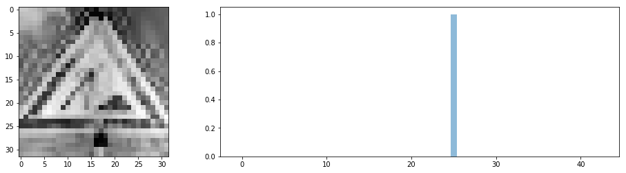

**Traffic Signs Classifier**
============================

We built a traffic signs classifier using the [German Traffic Sign
Dataset](http://benchmark.ini.rub.de/?section=gtsrb&subsection=news), deep
learning and TensorFlow. A 98.9% accuracy has been obtained on the test set
which is higher than that of humans (98.83%) thanks to ideas
from [sermanet-ijcnn-11](http://yann.lecun.com/exdb/publis/pdf/sermanet-ijcnn-11.pdf).

Code
----

The associated code is located at: [Traffic Sign Classifier Jupyter
Notebook.](https://github.com/phfrohring/CarND-Traffic-Sign-Classifier-Project/blob/master/Traffic_Sign_Classifier.ipynb)

Data Set Summary & Exploration
------------------------------

-   Images are 32×32 pixels over 3 colours channels : 32×32×3

-   There are 43 classes of images.

-   The data set counts 51839 images distributed over 3 subsets: Training,
    Validation and Test sets.

-   The Training Set counts 70% of all images, Validation Set 20% and Test Set
    10%.

-   The distribution of images across the different classes is uneven:

-   In all images, the vast majority of pixels are attributed to the signs.
    Contrasts, blurring and kinds of noises are uneven:

-   We would have a hard time identifying generated images from original images,
    should we add a few by manipulating contrast, blurring, rotations,
    translations, and noises:

Preprocessing
-------------

We use the [scikit-image](http://scikit-image.or) to preprocess images. The
preprocessing step consists of 3 transformations: correcting the contrast,
grayscaling then removing the mean from pixels value. We then generate images to
have an even distribution of images across classes using translations,
rotations, blurring and noise on original images. We did not include the edge
detection data since we judged the data too noisy. The transformations are
described below.

### Contrast

It’s possible to equalise the contrast across the images using a function for
the [scikit-image](http://scikit-image.or) library. It let the model focus on
the differences that matters, i.e. the signs, more than the contrast variations
from one image to an other.

Here is a before and after comparison:

### Grayscale

Since the differences between the signs seem to rely essentially on shapes and
forms, it's worth trying to grayscale the images because it divides the number
of pixels by 3 (1 gray channel instead of 3 RGB channels) and keeps what
matters: shapes and forms.

Here is a before and after comparison:

### Edge detection

All signs are bounded by a geometrical form: circle, triangle, square... The
edge of the bounding form makes a sharp contrast with the background. I thought
it might be a good idea to augment the grayscale images with detected edges
using the Canny algorithm:

Here is a before and after comparison:

Unfortunatly and after many trial and errors, I did not find a good enough set
of parameters. Images are too small maybe? First order derivative eats at least
2x the pixels compared to images themselves.

### Scaling

Finally, we scale the images so that pixels values have zero mean. It makes the
optimisation easier and does not subtract information from the images because it
is not encoded in their pixels absolute values but the relative differences
between pixels, which is preserved by translation:

~~~~~~~~~~~~~~~~~~~~~~~~~~~~~~~~~~~~~~~~~~~~~~~~~~~~~~~~~~~~~~~~~~~~~~~~~~~~~~~~
A preprocessed image mean = -1.04083408559e-17 ≈ 0
~~~~~~~~~~~~~~~~~~~~~~~~~~~~~~~~~~~~~~~~~~~~~~~~~~~~~~~~~~~~~~~~~~~~~~~~~~~~~~~~

### Generating images

Here is an example of a rotated, translated image with added gaussian noise:

We apply these ransom transformations on all classes so that they all have the
same number of images. Compare this distribution of images across classes with
the one above:

Model
-----

The model is essentially LeNet-5 ([LeCun
98](http://yann.lecun.com/exdb/publis/pdf/lecun-01a.pdf)) evolved using ideas
from
 [sermanet-ijcnn-11](http://yann.lecun.com/exdb/publis/pdf/sermanet-ijcnn-11.pdf),
because it showed to be working on similar objects: digits classification.
Instead of digits, we have signs for which I cannot find any good reason why it
would not work, *a priori*.

We first started
with [LetNet-5](http://yann.lecun.com/exdb/publis/pdf/lecun-01a.pdf) and data
re-splitted across training, validation and test into 70%, 20% and 10% of whole
data respectively. The 93.8% accuracy on the test set gave us reasons to
continue to invest time into improving its performance.

Grayscaling the images led to a 1.2% improvement up to 95.0% accuracy on the
test set. Centering the pixels values around 0 lead to a 1.3% improvement up to
96.3% accuracy on the test set. Making the distribution of training images even
across classes lead to a 1.3% improvement up to 97.3% accuracy on the test set.
We flattened and concatenated the outputs of the all convolutional layers into
the first fully connected layer as done
in [sermanet-ijcnn-11](http://yann.lecun.com/exdb/publis/pdf/sermanet-ijcnn-11.pdf),
augmented the number of epochs and divided the learning rate by augmenting the
size of the batches up to 512 for a 0.8% increase up to 98.4% accuracy on the
test set. We added the a dropout layer in between the fully connected layers of
a 0.3% accuracy increase up to 98.7% accuracy on the test set. We added a 1x1
convolutional layer at the beginning of the network and increased the depth of
all layers, increased the batch size up to 1024 to have a lower learning rate
and augmented the number of epochs to 30 for a 0.3% accuracy increase up to
99.0% accuracy on the test set.

Training
--------

[Practical Recommendations for Gradient-Based Training of Deep
Architectures](https://arxiv.org/pdf/1206.5533.pdf) gives this formula that
helps understanding how `batch_size` and `learning_rate` are related:

The bigger the batch (**B**), the lower the resulting `learning_rate`. A bigger
batch also means a bigger region of the cost function that is optimized at each
batch. For this reason, we prefered to increase the `batch_size` as long as the
time/space performance where acceptable during the trial and error phase. The
smaller the learning rate, the higher the number of epochs to compensate the
smaller steps and avoiding getting stuck into a local minimum. Too many epochs
and we are at risk of overfitting: the network learns the data set instead of
how to generalize it. We just don't train past a certain amount of epochs when
we see that the accuracy does not improve anymore.

[Adam: A Method for Stochastic
Optimization](https://arxiv.org/abs/1412.6980) makes a great case for using
the `AdamOptimizer` instead of others.

>   6.3 EXPERIMENT: CONVOLUTIONAL NEURAL NETWORKS
>
>   We show the effectiveness of Adam in deep CNNs. Our CNN architecture has
>   three alternating stages of 5x5 convolution filters and 3x3 max pooling with
>   stride of 2 that are followed by a fully connected layer of 1000 rectified
>   linear hidden units (ReLU’s). The input image are pre-processed by
>   whitening, and dropout noise is applied to the input layer and fully
>   connected layer.
>
>   Interestingly, although both Adam and Adagrad make rapid progress lowering
>   the cost in the initial stage of the training, shown in Figure 3 (left),
>   Adam and SGD eventually converge considerably faster than Adagrad for CNNs
>   shown in Figure 3 (right).

Performance
-----------

We reach 99.0% accuracy on the validation set and 98.9% on the test set which is
on par with human performance: 98.8%
([sermanet-ijcnn-11](http://yann.lecun.com/exdb/publis/pdf/sermanet-ijcnn-11.pdf)).

The model is evenly accurate across classes:

As a reminder, precision compares the number of true positives against true
positives and false positives. Recall compares the number of false negatives
against false negatives and true positives. High precision means that when the
model says that a sign belong to a given class then it has high chances to be
correct. High recall means that there are low chances for the model to miss
instances of a given class.

Here are precisions and recalls per classes of the model:

We see that even if accuracy is even, precision and recall are not. For example,
class 0 has high recall and low precision. It means that the model identify
correctly most of the instances belonging to the class 0 (recall) but makes
relatively more mistakes when predicting that an instance belongs to the class
0. There is no point making the precision higher by augmenting the number of
true positives since it’s already high (recall). So the only way to make the
precision higher is by reducing the number of false positives. It’s equivalent
to reduce overfitting. Maybe a higher dropout rate would help and/or trying
different image generation distributions. Or maybe building an other network
which only job is to double check class 0 predictions?

Test On New Images
------------------

To test our newly trained shiny and promising model, we took a couple of images
of German traffic signs outside of the data set. Let's see if the model can make
predictions. Here are the selected images:

After preprocessing:

Here is what the model believes the images classes are:

Which leads to this classification:

Which leads to an accuracy of 100%. There was no real difficulty *a priori* for
the network to classify these signs: no extreme contrast, overlapping
environment, bad centring, damaged signs, bad weather, etc. The new images are
not numerous nor diverse enough to have any kind of significance: it does not
mean anything and could even be misleading.

Neural Network's State
----------------------

As NVIDIA's did in their paper [End-to-End Deep Learning for Self-Driving
Cars](https://devblogs.nvidia.com/parallelforall/deep-learning-self-driving-cars/) in
the section Visualization of internal CNN State, let's show the internal state
of our model. Given the following input image:

Here are the intermediary representation in the first convolutional layer (after
the 1x1):

Amazing! The network learned on its own features that matter: we can
distinctively see features of the signs in the hidden layers. That said, given
this map of features, how this information can be used to update the model for
improved performance? E.g. `FeatureMap1` and `FeatureMap5` are almost the same.
Is that redundancy an assest because it gives more robustness to the model or is
it a liability in the sense that the model could do equally good without this
redundancy?
